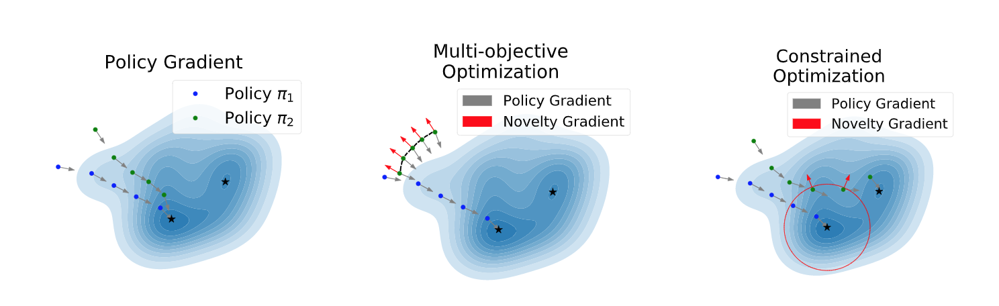

# Novel Policy Seeking with Constrained Optimization


## Quick Start


This repo provides the code for the work *Novel Policy Seeking with Constrained Optimization*. The only dependencies are pytorch, gym and mujoco. 

To reproduce the results reported in the paper, please run the follows:

1. Train 10 policies with different random seeds with PPO:

```
python ppo_gpu.py --env_name Hopper-v3 --hid_num 10 --num_episode 800 --use_gpu 6 --num_repeat 10
```

we provide 10 pre-trained policies for each environment used in the paper.

2. Train novel policies with different Novelty Seeking methods, e.g., WSR, TNB, CTNB, IPD, etc.

```bash
python CTNB.py --env_name Hopper-v3 --hid_num 10 --num_episode 800 --use_gpu 7 --thres 0.6 --file_num CTNB --num_repeat 10

python TNB.py --env_name Hopper-v3 --hid_num 10 --num_episode 800 --use_gpu 6 --thres 0.0 --file_num TNB --num_repeat 10

python WSR.py --env_name Hopper-v3 --hid_num 10 --num_episode 800 --use_gpu 5 --thres 0.0 --file_num WSR --num_repeat 10 --weight 0.5

python IPD.py --env_name Hopper-v3 --hid_num 10 --num_episode 800 --use_gpu 4 --thres 0.6 --file_num IPD --num_repeat 10
```

## Bibtex

```
@article{sun2020novel,
  title={Novel Policy Seeking with Constrained Optimization},
  author={Sun, Hao and Peng, Zhenghao and Dai, Bo and Guo, Jian and Lin, Dahua and Zhou, Bolei},
  journal={arXiv preprint arXiv:2005.10696},
  year={2020}
}
```
